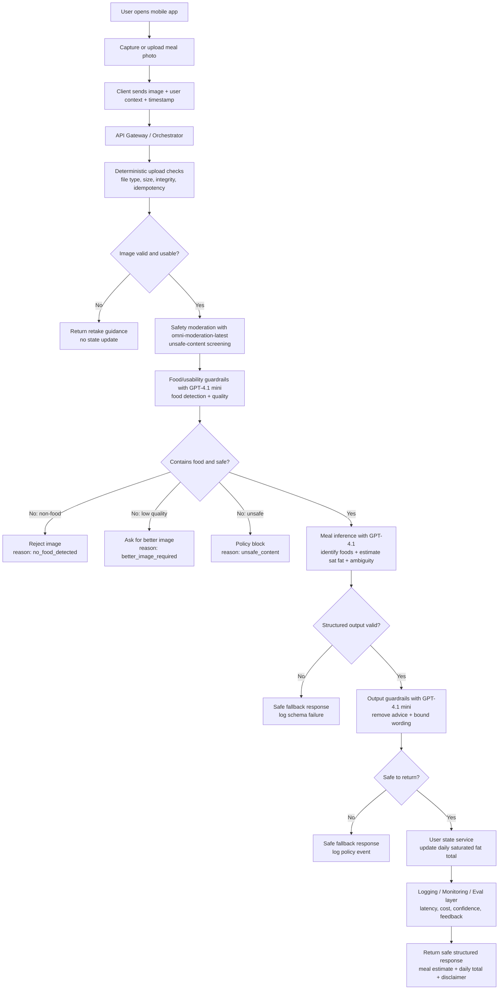
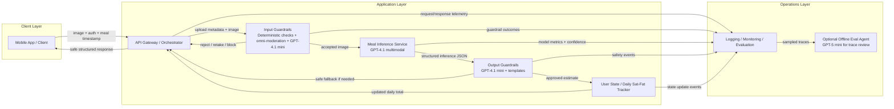
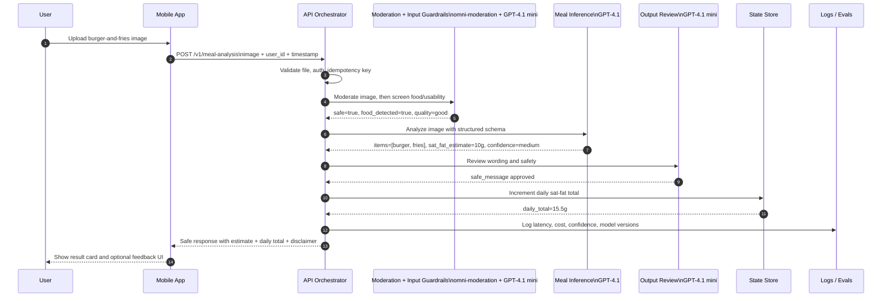

# Visual Diagrams — Meal Analysis Cholesterol App

This file provides presentation-ready visual diagrams for the Phase 1 meal analysis workflow, plus a reviewed production architecture that identifies the main application components, AI components, model choices, and where an agent is **not** required.

## Recommended production stance

For this use case, the best production default is a **deterministic orchestrator with bounded model calls**, not a free-running agent in the hot path.

### Main components to call out in architecture review

| Layer | Component | Type | Why it exists |
|---|---|---|---|
| Client | Mobile App / Client | Product component | Captures image, sends authenticated request, renders estimate and fallback UX. |
| API | API Gateway / Orchestrator | Backend control plane | Handles auth, routing, idempotency, timeouts, schema validation, and response assembly. |
| Guardrails | Upload integrity checks | Deterministic service | Rejects bad files early and cheaply. |
| Guardrails | Input safety moderation | Moderation model | Screens images for unsafe/disallowed content before inference. |
| Guardrails | Food/usability classifier | AI/vision step | Determines whether the image is food and usable before expensive inference. |
| Inference | Meal inference model | Main multimodal LLM | Identifies likely food items, portion cues, ambiguity flags, and estimated saturated fat. |
| Guardrails | Output safety reviewer / formatter | Text LLM + deterministic templates | Ensures bounded, non-medical, schema-safe messaging. |
| State | Daily saturated-fat tracker | Backend state service | Stores meal events and updates the running daily total idempotently. |
| Ops | Logging / Monitoring / Eval | Observability + QA | Tracks latency, cost, confidence, safety, corrections, and prompt/model versions. |
| Optional | Background eval / trace reviewer | Offline agentic workflow | Useful for grading traces and reviewing failures, but not required in the request path. |

### Recommended OpenAI model mapping for Phase 1

| Workflow step | Recommended model / capability | Why |
|---|---|---|
| Input safety moderation | `omni-moderation-latest` | Free, purpose-built moderation for image and text safety checks. |
| Input food detection + image usability | `gpt-4.1-mini` with image input | Lower-cost, lower-latency vision pass for accept/reject/retake routing. |
| Core meal inference | `gpt-4.1` with image input | Stronger multimodal reasoning for mixed meals, portion cues, and ambiguity handling. |
| Output review / safe formatting | `gpt-4.1-mini` text step | Good fit for low-latency policy checks and bounded message generation. |
| Optional eval / review agent | `gpt-5-mini` or stronger text model for offline grading/planning | Better suited for agent-style analysis, evals, and trace review than the synchronous hot path. |

### Agent recommendation

- **Do not use an autonomous agent as the primary online workflow** for Phase 1 meal analysis.
- Use a **single orchestrator service** that makes explicit, typed calls to small model steps.
- If you want agents at all, use them **offline** for eval triage, trace review, or prompt/policy analysis rather than for every user request.

## 1. Process Flow

### Process flow notes
- The workflow is intentionally bounded: validate first, infer second, then apply output safety and state updates.
- Rejections and low-confidence cases return safe UX paths instead of forcing a best guess.
- Logging is part of the runtime path so every request can feed monitoring and eval.

## 2. High-level Architecture

### Architecture interaction notes
- **Mobile app / client** captures the image, includes authenticated user context, and renders bounded results.
- **API gateway / orchestrator** is the control plane for routing, idempotency, timeouts, validation, and final response assembly.
- **Input guardrails** prevent wasted inference cost and reduce downstream hallucination risk by filtering unusable or non-food images.
- **Meal inference service** is the main multimodal reasoning step and should return structured outputs only.
- **Output guardrails** enforce health-tech safety boundaries and remove diagnosis, treatment, or overconfident language.
- **User state tracker** manages the daily saturated-fat tally and must be idempotent.
- **Logging, monitoring, and evaluation** supports release gating, production monitoring, failure analysis, and prompt/model iteration.
- **Optional offline eval agent** can review traces and failure clusters, but should not own the synchronous user path.

## 3. Production Example — Recommended OpenAI flow

### Why this is the recommended production example
- It uses a **cheap first-pass model** before invoking the stronger multimodal step.
- It keeps the **most expensive reasoning** focused on the accepted-image slice.
- It uses a **second bounded review pass** rather than re-running the entire request.
- It preserves a **deterministic state update boundary** after output approval.
- It leaves **agentic behavior** to offline evaluation and iteration workflows where the risk is lower.

## 4. OpenAI-aligned implementation notes

- Use the **Responses API** for image understanding and structured orchestration, and the **Moderations API** for explicit image safety checks.
- Use **Structured Outputs** instead of plain JSON mode wherever supported so downstream parsing and state updates stay reliable.
- Use image `detail: low` for cheap screening and `detail: high` only when the stronger inference step truly needs more visual fidelity.
- Keep prompts and schemas versioned so logs can attribute failures to exact workflow versions.
- Put the static instructions first in prompts to benefit from prompt caching on repeated prefixes.

## Recommended usage
- Use the **Process Flow** diagram in the presentation section covering request lifecycle and fallback behavior.
- Use the **High-level Architecture** diagram in the presentation section covering system design, responsibilities, AI components, and operational readiness.
- Use the **Production Example** diagram when explaining why the orchestrator-first pattern is safer than a free-running agent for Phase 1.
